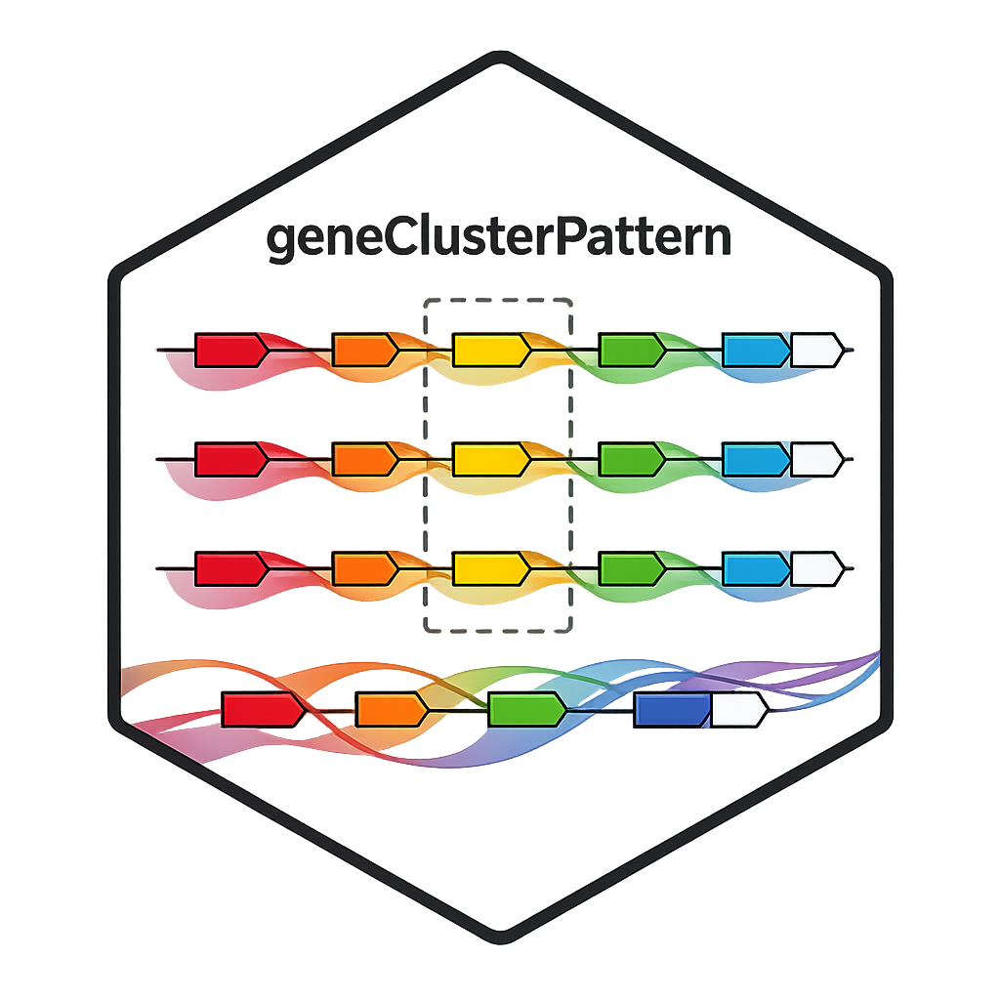

# geneClusterPattern 

**geneClusterPattern** is an R package for constructing and comparing ortholog gene patterns around a focal gene across species.

It enables the exploration of conserved gene neighborhoods (synteny) by organizing orthologous genes within a defined genomic window and aligning their relative positions across multiple genomes.

---

## Overview

Understanding how gene order is conserved across species provides insight into genome evolution and functional relationships between genes. **geneClusterPattern** facilitates this by building ortholog gene patterns centered on a gene of interest and comparing their surrounding genomic context across species.

The package supports two main sources of orthology information:

* Homolog retrieval from Ensembl (via Compara)
* Ortholog group assignments from OrthoFinder

These inputs are used to reconstruct ordered gene neighborhoods and generate comparable ortholog patterns across species.

---

## Features

* Retrieve homologs directly from Ensembl
* Support orthogroup input from OrthoFinder
* Construct gene patterns around a focal gene
* Configurable upstream and downstream window size
* Multi-species comparison
* Tidy, analysis-friendly output
* Visualization-ready structure for plotting gene patterns

---

## Installation

```r
# install.packages("devtools")
devtools::install_github("jianhong/geneClusterPattern")
```

---

## Use Cases

* Conserved synteny analysis
* Comparative genomics
* Evolution of gene clusters
* Functional context of genes
* Cross-species genome organization studies

---

## Documentation

To view documentation of `geneClusterPattern`, start R and enter:

```{r}
browseVignettes('geneClusterPattern')
```

The documentation are also available [online](https://jianhong.github.io/geneClusterPattern/).

---

## Contributions and Support

If you would like to contribute to this package, the standard workflow
is as follows:

1.  Check that there isn’t already an issue about your idea in the
    [jianhong/geneClusterPattern/issues](https://github.com/jianhong/geneClusterPattern/issues)
    to avoid duplicating work. If there isn’t one already, please create
    one so that others know you’re working on this
2.  [Fork](https://help.github.com/en/github/getting-started-with-github/fork-a-repo)
    the [jianhong/geneClusterPattern](https://github.com/jianhong/geneClusterPattern)
    to your GitHub account
3.  Make the necessary changes / additions within your forked repository
    following [Bioconductor
    contribution](https://contributions.bioconductor.org/)
4.  Use `devtools::build` and `devtools::check` to check the package
    work properly.
5.  Submit a Pull Request against the `main` or current
    `RELEASE_VERSION` branch and wait for the code to be reviewed and
    merged.

If you’re not used to this workflow with git, you can start with some
[docs from GitHub](https://help.github.com/en/github/collaborating-with-issues-and-pull-requests)
or even their [excellent `git` resources](https://try.github.io/).

For further information or help, don’t hesitate to create a new issues at 
[jianhong/geneClusterPattern/issues](https://github.com/jianhong/geneClusterPattern/issues).

---

## Reporting bug/issues

Many thanks for taking an interest in improving this package. Please
report bug/issues at
[jianhong/geneClusterPattern/issues](https://github.com/jianhong/geneClusterPattern/issues).


